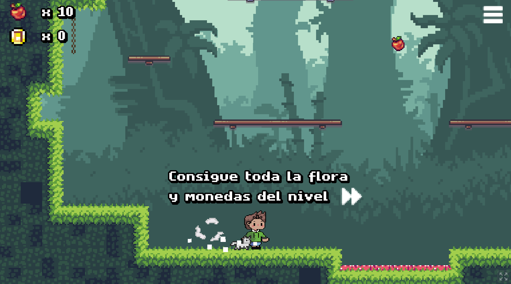
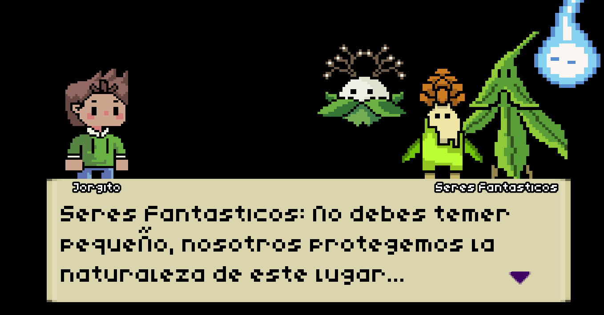
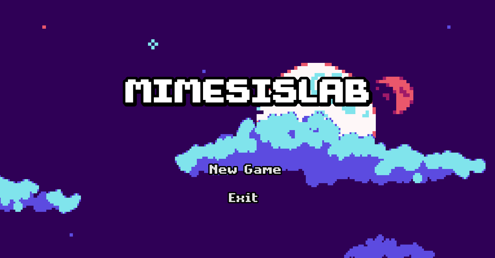

# MimesisLab - ORIGIN

Educational 2D platformer for children, built in Godot as a university final project. The player follows a boy from the Chocó Andino region of Ecuador who meets characters inspired by the native plants of the area. Through their dialogues, the game shares stories about the ecosystem and raises awareness about caring for the environment.

Designed and developed entirely by me: gameplay, level design, narrative, UI and game flow.

## Play

- Web build: https://math-pd00.itch.io/mimesis

## Features

- Player movement with 2D physics and double jump
- Camera that follows the player through the level
- Dialogue sequences with characters inspired by native plants of the Chocó Andino
- Coin-based progression: all coins must be collected to unlock the next level
- Environmental traps the player has to avoid
- Main menu, pause menu and game over screen

## Controls

| Action | Key |
| --- | --- |
| Move | [A,D] |
| Jump / double jump | [Space] |

## Screenshots

## Built with

- Godot Engine [3.6]
- GDScript

## Run locally

1. Install Godot [3.6].
2. Clone this repository.
3. Open Godot, choose **Import**, and select the `project.godot` file.
4. Press **F5** to run the game.

## Author

Matheo Poma Dávila — [LinkedIn] https://www.linkedin.com/in/matheo-poma-d%C3%A1vila-87031628a/